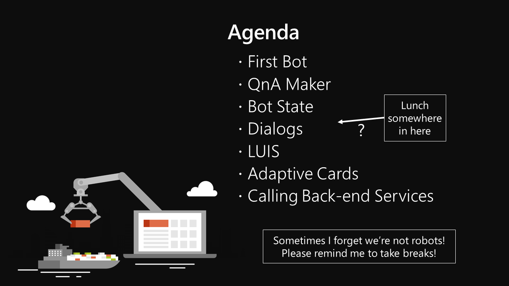
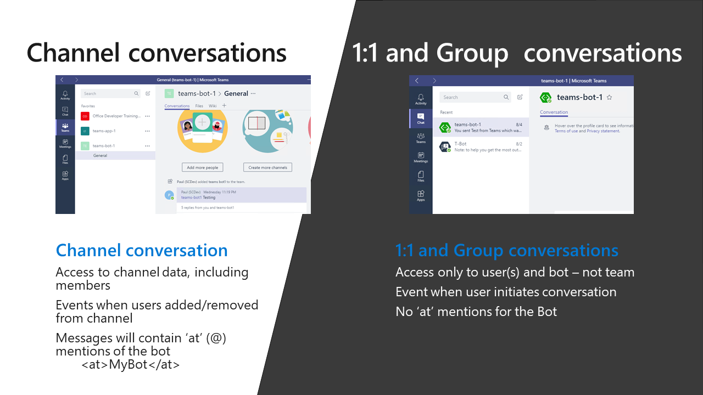

# I, Chatbot

Welcome to I, Chatbot, a workshop all about building bots for Microsoft Teams and Sharepoint using the latest version of the Bot Framework.

These notes are intended as a companion for the workshop. Most of the slides are here; some text slides have been placed directly into the text of these notes. There is a markdown file for each section of the workshop as follows:

* [Part 1 - First Bot](01-FirstBot.md) <-- this section
* [Part 2 - QnA Maker](02-QnAMaker.md)
* [Part 3 - Bot State](03-State.md)
* [Part 4 - Dialogs](04-Dialogs.md)
* [Part 5 - LUIS](05-LUIS.md)
* [Part 6 - Adaptive Cards](06-AdaptiveCards.md)
* [Part 7 - Calling back-end services](07-CallingServices.md)

## Part 1: First Bot

### Eliza

[Alan Turing](https://en.wikipedia.org/wiki/Alan_Turing) may be best known for cracking the Enigma machine, a cryptographic device used by Germany during World War II. In 1950, Turing proposed what is now called the Turing Test of a machine's ability to exhibit intelligent behavior. If a human evaluator is unable to distinguish natural language conversations with those of the machine and those of a human, the test is passed.

In 1966, [Joseph Weizenbaum](https://en.wikipedia.org/wiki/Joseph_Weizenbaum) completed [Eliza](https://en.wikipedia.org/wiki/ELIZA), a program intended to pass the Turing Test. The most famous script, “Doctor”, simulated a Rogerian psychotherapist, based on the work of Carl Rogers who was well known for parroting back to patients whatever they had just said. In 2005, Norbert Lansteiner ported [Eliza to JavaScript](https://www.masswerk.at/elizabot/).

CHALLENGE
---------

There is a copy of Eliza in Plunker, ready for you to play with! (Plunker is a JavaScript playground that runs in any modern web browser).

Your challenge is to run the plunk at [http://bit.ly/ElizaPlunk](http://bit.ly/ElizaPlunk) and:

1. Run Eliza and decide if you think it passes the Turing Test
2. Modernize Eliza by adding SharePoint to all references to dreams and dreaming

## OK

Repos used:

https://github.com/BobGerman/Bots
https://github.com/coolc0ders/Real-Proactive-Message-Bot
https://github.com/microsoft/BotBuilder-Samples
https://github.com/BobGerman/BotBuilder-MicrosoftTeams-dotnet
https://github.com/OfficeDev/msteams-samples-outgoing-webhook-nodejs
https://github.com/OfficeDev/msteams-sample-contoso-hr-talent-app.git

