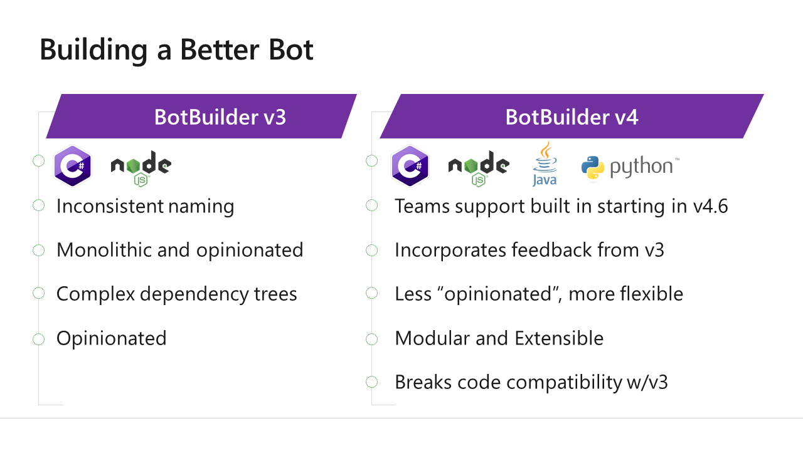

# I, Chatbot

Welcome to I, Chatbot, a workshop all about building bots for Microsoft Teams and Sharepoint using the latest version of the Bot Framework.


These notes are intended as a companion for the workshop. Most of the slides are here; some text slides have been placed directly into the text of these notes. There is a markdown file for each section of the workshop as follows:

* [Part 1 - First Bot](01-FirstBot.md) <-- this section
* [Part 2 - QnA Maker](02-QnAMaker.md)
* [Part 3 - Bot State](03-State.md)
* [Part 4 - Dialogs](04-Dialogs.md)
* [Part 5 - LUIS](05-LUIS.md)
* [Part 6 - Adaptive Cards](06-AdaptiveCards.md)
* [Part 7 - Calling back-end services](07-CallingServices.md)

Some of the sections include challenges; many of these are for you to take home after the workshop, since it's not feasible to get everybody set up with the right tools and subscriptions. A few of the challenges require just a web browser, and can be completed during the workshop as time permits.

## Part 1: First Bot

### Bots are Hot


Though they've been around for quite a while, chatbots have recently gained a lot of popularity. Microsoft alone processes some 30 million bot messages each day for thousands of Azure subscribers.


Bots use natural language rather than a computer-friendly command syntax. Otherwise your bot is just a command line program hosted as if it was a bot.

### Eliza


[Alan Turing](https://en.wikipedia.org/wiki/Alan_Turing) may be best known for cracking the Enigma machine, a cryptographic device used by Germany during World War II. In 1950, Turing proposed what is now called the Turing Test of a machine's ability to exhibit intelligent behavior. If a human evaluator is unable to distinguish natural language conversations with those of the machine and those of a human, the test is passed.


In 1966, [Joseph Weizenbaum](https://en.wikipedia.org/wiki/Joseph_Weizenbaum) completed [Eliza](https://en.wikipedia.org/wiki/ELIZA), a program intended to pass the Turing Test. The most famous script, “Doctor”, simulated a Rogerian psychotherapist, based on the work of Carl Rogers who was well known for parroting back to patients whatever they had just said. In 2005, Norbert Lansteiner ported [Eliza to JavaScript](https://www.masswerk.at/elizabot/).

The workshop opens by examining this, arguably the very first chatbot.

---
__**CHALLENGE**__

There is a copy of Eliza in Plunker at [http://bit.ly/ElizaPlunk](http://bit.ly/ElizaPlunk), ready for you to experiment with! (Plunker is a JavaScript playground that runs in any modern web browser).


Your challenge is to run the plunk  and:

1. Run Eliza and decide if you think it passes the Turing Test
2. Modernize Eliza by adding SharePoint to all references to dreams and dreaming
---


## Webhooks

Simple HTTPS calls can be used as sort of proto-bots; these are called incoming and outgoing webhooks. 

 - Incoming webhooks send messages into a Team. They are similar to [Office 365 Connectors](https://www.microsoft.com/en-us/microsoft-365/blog/2016/03/25/introducing-office-365-connectors/), which can do the same thing across multiple teams.
 - Outgoing webhooks allow users to send messages to a web service, but there is no support for an actual conversation.

The demo shows these in Microsoft Teams. There's a [good tutorial here.](https://docs.microsoft.com/en-us/microsoftteams/platform/webhooks-and-connectors/what-are-webhooks-and-connectors)

## Azure Bot Service

Check out the Bot Framework [Principles of Design](https://docs.microsoft.com/en-us/azure/bot-service/bot-service-design-principles) for more details.


The [Azure Bot Service](https://azure.microsoft.com/en-us/services/bot-service/) includes a channel service that is required by Microsoft Teams. You can host your bot anywhere on the Internet.

The [Azure Bot Framework](https://dev.botframework.com/) (a.k.a. Bot Builder SDK) is an optional library that makes it easier to write bots for the Azure Bot Service.



The Bot Framework just got a big overhaul, and v3 bots will need a big overhaul to get to v4! Make sure the sample or documentation you're looking at is for the correct version.

* [Differences between v3 and v4](https://docs.microsoft.com/en-us/azure/bot-service/migration/migration-about?view=azure-bot-service-4.0)
* [Migration guide](https://docs.microsoft.com/en-us/azure/bot-service/migration/conversion-framework?view=azure-bot-service-4.0)
* [Deprecation of Teams Extensions for Bot Builder SDK and very soft announce that Teams is now integrated into v4.6](https://github.com/OfficeDev/BotBuilder-MicrosoftTeams)

Remember that what changed is just the SDK that runs inside the Bot; the service and its REST protocol didn't change, so v3 bots will continue to work. And you can skip the entire Bot Framework and build your own by using the [REST services](https://docs.microsoft.com/en-us/azure/bot-service/rest-api/bot-framework-rest-overview) directly.


The [Bot Channel Service](https://docs.microsoft.com/en-us/azure/bot-service/bot-service-manage-channels?view=azure-bot-service-4.0) is part of Azure Bot Services that routes activities from a variety of applications to a compatible Bot. This allows a Bot to work on multiple "channels" simultaneously. Don't confuse Bot Channels with Teams Channels!

* [What is an activity?](https://github.com/Microsoft/botframework-sdk/blob/master/specs/botframework-activity/botframework-activity.md)
* What is a message? A message is [one type of activity](https://github.com/Microsoft/botframework-sdk/blob/master/specs/botframework-activity/botframework-activity.md#message-activity)


Bot interactions are organized into "turns". The article, [How do Bots work?](https://docs.microsoft.com/en-us/azure/bot-service/bot-builder-basics?view=azure-bot-service-4.0&tabs=csharp) explains this well.


The simplest bot for Teams is an "Outgoing Webhook". The code used in the demo is [here](https://github.com/OfficeDev/msteams-samples-outgoing-webhook-nodejs).

Bot Framework templates are available for NodeJS (JavaScript or TypeScript) and for .NET COre (C#).
The templates include:

* Blank bot - completely minimal; you need to add code to make it work at all
* Echo bot - very simple working bot that echoes messages back
* Core bot - functional bot with dialogs and LUIS integration that takes simplified airline reservations

It will be useful to walk through some of the code generated by these templates; you can find it [here in this repo](../Templates/).

Here's what you need to get started:

### NodeJS

Step by step instructions to set up your development environment are [here](https://docs.microsoft.com/en-us/azure/bot-service/javascript/bot-builder-javascript-quickstart?view=azure-bot-service-4.0) and [here](https://github.com/Microsoft/BotBuilder-Samples/tree/master/generators/generator-botbuilder).

Install the [latest LTS version of Node](https://nodejs.org/en/download/) and then these commands:

~~~shell
npm install -g yo
npm install -g generator-botbuilder
~~~

To generate a project,
~~~shell
yo botbuilder
~~~

If you've downloaded a sample, install the required npm packages with 

~~~shell
npm install
~~~

Then run your bot with 

~~~shell
npm start
~~~

### C#/.NET Core

Step by step instructions to set up your development environment are [here](https://github.com/microsoft/BotBuilder-Samples/tree/master/generators/dotnet-templates).

Visual Studio users, download the [Bot Framework v4 SDK Templates](https://marketplace.visualstudio.com/items?itemName=BotBuilder.botbuilderv4) or follow [the quickstart](https://docs.microsoft.com/en-us/azure/bot-service/dotnet/bot-builder-dotnet-sdk-quickstart?view=azure-bot-service-4.0).

If you want to travel light or develop cross-platform, just install [Visual Studio Code](https://code.visualstudio.com/) and [.NET Core](https://dotnet.microsoft.com/download/dotnet-core). Ensure you have v2.1 or newer:

```shell
 dotnet --version
```

Then install the templates you want:

~~~shell
dotnet new -i Microsoft.Bot.Framework.CSharp.EchoBot
dotnet new -i Microsoft.Bot.Framework.CSharp.CoreBot
dotnet new -i Microsoft.Bot.Framework.CSharp.EmptyBot
~~~

To create a new project:

~~~shell
dotnet new echobot --framework netcoreapp2.1 -n MyEchoBot
~~~


Downloads:

* [Bot Framework Emulator](https://docs.microsoft.com/en-us/azure/bot-service/bot-service-debug-emulator) ([source code](https://github.com/microsoft/BotFramework-Emulator))
* [NGrork tunneling](https://ngrok.com/)


For more details, read [How Bots Work](https://docs.microsoft.com/en-us/azure/bot-service/bot-builder-basics?view=azure-bot-service-4.0&tabs=csharp).


For the full list of event handlers, see the methods of the ActivtyHandler class ([C#](https://docs.microsoft.com/en-us/dotnet/api/microsoft.bot.builder.activityhandler?view=botbuilder-dotnet-stable) or [JavaScript](https://docs.microsoft.com/en-us/javascript/api/botbuilder-core/activityhandler?view=botbuilder-ts-latest)).


Check [this article](https://docs.microsoft.com/en-us/azure/bot-service/bot-builder-concept-middleware?view=azure-bot-service-4.0) to learn more about Bot Framework middleware.

The Teams Bot Builder SDK includes Teams-specific middleware; Beta version is here ([.NET Core](https://developer.microsoft.com/en-us/office/blogs/preview-release-of-net-teams-bot-builder-v4-sdk/), [Node](https://developer.microsoft.com/en-us/graph/blogs/preview-release-of-the-node-js-bot-builder-v4-sdk-for-microsoft-teams/)).


* [.NET Core dependency injection and middleware setup](../ConsultingBot/ConsultingBot/Startup.cs)
* [Simple middleware](../ConsultingBot/ConsultingBot/Middleware/StripBotMention.cs)
* [JavaScript middleware setup](../TeamsStateBot/index.js)

### [The next section is here](02-QnAMaker.md)

## Repos used in this workshop:

1. [https://github.com/BobGerman/Bots](https://github.com/BobGerman/Bots): Bob's repo, containing samples specific to this workshop, and these notes

1. [https://github.com/microsoft/BotBuilder-Samples](https://github.com/microsoft/BotBuilder-Samples): Great samples for Bot Framework - now including Teams examples!

1. [https://github.com/OfficeDev/msteams-samples-outgoing-webhook-nodejs](https://github.com/OfficeDev/msteams-samples-outgoing-webhook-nodejs): Outgoing webhook - the simplest bot for Teams


1. [https://github.com/OfficeDev/msteams-sample-contoso-hr-talent-app.git](https://github.com/OfficeDev/msteams-sample-contoso-hr-talent-app.git): Great Teams bot/app sample showing an HR recruiting application

