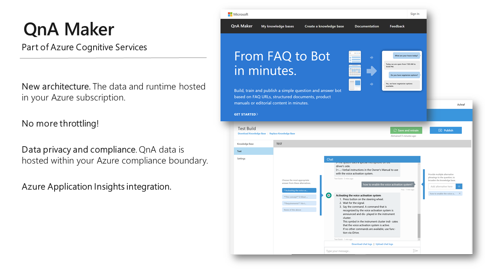
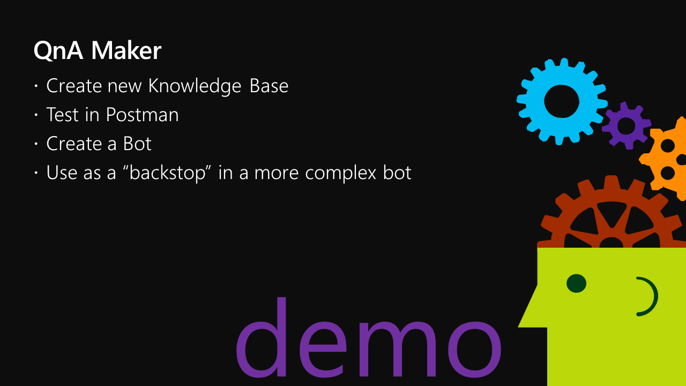

# I, Chatbot

Table of Contents

* [Part 1 - First Bot](01-FirstBot.md)
* [Part 2 - QnA Maker](02-QnAMaker.md) <-- this section
* [Part 3 - Bot State](03-State.md)
* [Part 4 - Dialogs](04-Dialogs.md)
* [Part 5 - LUIS](05-LUIS.md)
* [Part 6 - Adaptive Cards](06-AdaptiveCards.md)
* [Part 7 - Calling back-end services](07-CallingServices.md)

## QnA Maker

[QnA Maker](https://www.qnamaker.ai/) is part of [Azure Cognitive Services](https://azure.microsoft.com/en-us/services/cognitive-services/). It's a service that interprets Frequently Asked Questions to build "knowledge bases" of questions and answers. Then it provides a REST service which returns the best answer for a natural language question.

QnA Maker is a great low-code/no-code approach to building a bot! However your bot will only be able to supply static answers to questions.

Check out the [QnA Maker quick start](https://docs.microsoft.com/en-us/azure/cognitive-services/qnamaker/how-to/create-knowledge-base).

The demo will use an incredibly useful tool for working with REST APIs called [Postman](https://www.getpostman.com/).

---
__**CHALLENGE**__ (after class)

* Sign up for [QnA Maker](https://www.qnamaker.ai/) and [set up the service](https://docs.microsoft.com/en-us/azure/cognitive-services/qnamaker/overview/overview#how-do-i-start) in Azure.
* Create a new knowledge base import a FAQ web page of your choice. Test it and tweak the questions and answers within the QnA Maker UI.
* From the QnA Maker Publish screen, create an Azure bot for the service and test in the Azure portal
* Use [Teams App Studio](https://docs.microsoft.com/en-us/microsoftteams/platform/get-started/get-started-app-studio) to create an app manifest for your bot and test it in Teams

---

### [The next section is here](03-State.md)

## Repos used in this workshop:

1. [https://github.com/BobGerman/Bots](https://github.com/BobGerman/Bots): Bob's repo, containing samples specific to this workshop, and these notes

1. [https://github.com/microsoft/BotBuilder-Samples](https://github.com/microsoft/BotBuilder-Samples): Great samples for Bot Framework - now including Teams examples!

1. [https://github.com/OfficeDev/msteams-samples-outgoing-webhook-nodejs](https://github.com/OfficeDev/msteams-samples-outgoing-webhook-nodejs): Outgoing webhook - the simplest bot for Teams

1. [https://github.com/OfficeDev/msteams-sample-contoso-hr-talent-app.git](https://github.com/OfficeDev/msteams-sample-contoso-hr-talent-app.git): Great Teams bot/app sample showing an HR recruiting application

