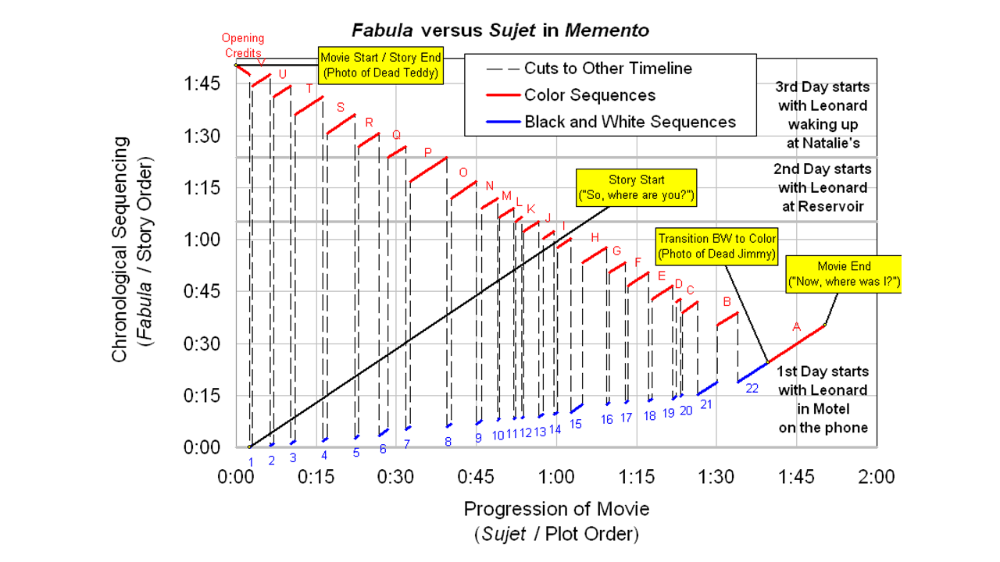
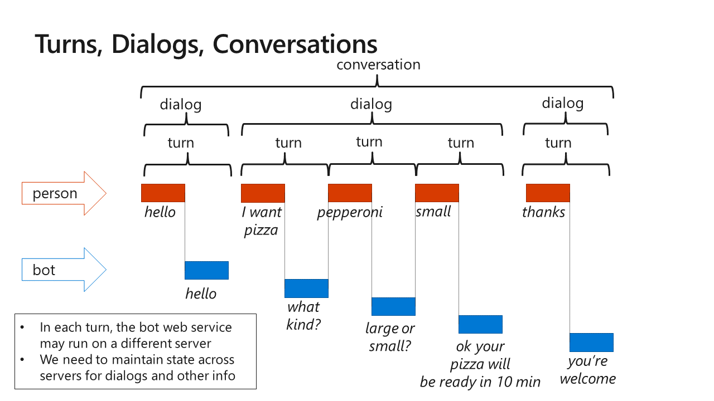
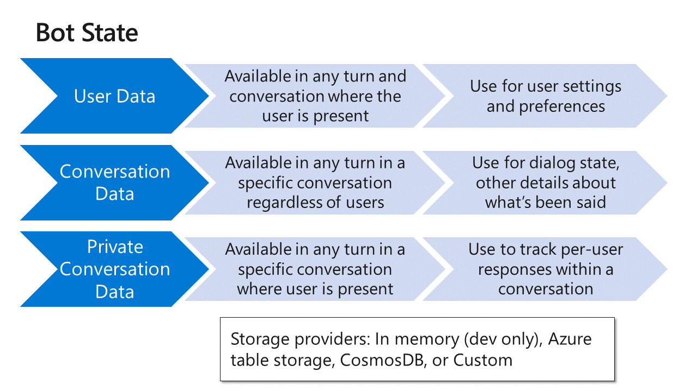
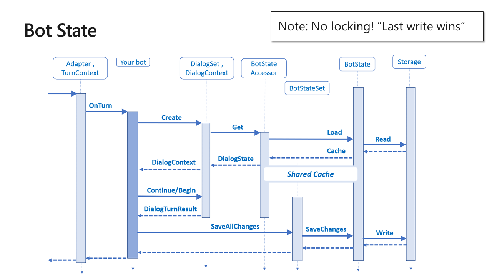

# I, Chatbot

Table of Contents

* [Part 1 - First Bot](01-FirstBot.md)
* [Part 2 - QnA Maker](02-QnAMaker.md)
* [Part 3 - Bot State](03-State.md) <-- this section
* [Part 4 - Dialogs](04-Dialogs.md)
* [Part 5 - LUIS](05-LUIS.md)
* [Part 6 - Adaptive Cards](06-AdaptiveCards.md)
* [Part 7 - Calling back-end services](07-CallingServices.md)

## Bot State

Perhaps you remember the movie [Memento](https://en.wikipedia.org/wiki/Memento_(film)), in which the protagonist, Leonard Shelby
([Guy Pearce](https://en.wikipedia.org/wiki/Guy_Pearce)) suffers from [anterograde amnesia](https://en.wikipedia.org/wiki/Anterograde_amnesia) and can't remember anything. Your bot will be like Leonard if you don't give it some way to keep track of _bot state_.

This slide shows the amazing timeline in Memento, in which recent events are shown in reverse chronological order, interspersed with past events. This has nothing to do with this workshop, except it inspired me to make the next slide, which shows how bot dialogs and conversations work.

Once we have state, we can carry on conversations that last more than one turn. This is done using _dialogs_, which are the next topic.

Since bots are web services, which may be load balanced across many services. The picture shows this by implying that each bot response might come from a different instance of the bot web service. Without bot state, you couldn't have dialogs. 

Here are the three kinds of bot state, as explained in [this article](https://docs.microsoft.com/en-us/azure/bot-service/bot-builder-concept-state). The following diagram is from the same article.

The StateBot sample is right [here in this repo](../StateBot).
The TeamsStateBot is [here, also in this repo](../TeamsStateBot).

---
__**CHALLENGE**__ (after class)

* Build the StateBot and test it using the Bot Framework emulator. Remember you can create a new session with the same user ID in the emulator in order to test user state.
* Add a feature which displays how long the bot has "known" the user.

---

### [The next section is here](04-Dialogs.md)

## Repos used in this workshop:

1. [https://github.com/BobGerman/Bots](https://github.com/BobGerman/Bots): Bob's repo, containing samples specific to this workshop, and these notes

1. [https://github.com/microsoft/BotBuilder-Samples](https://github.com/microsoft/BotBuilder-Samples): Great samples for Bot Framework - now including Teams examples!

1. [https://github.com/OfficeDev/msteams-samples-outgoing-webhook-nodejs](https://github.com/OfficeDev/msteams-samples-outgoing-webhook-nodejs): Outgoing webhook - the simplest bot for Teams

1. [https://github.com/OfficeDev/msteams-sample-contoso-hr-talent-app.git](https://github.com/OfficeDev/msteams-sample-contoso-hr-talent-app.git): Great Teams bot/app sample showing an HR recruiting application

