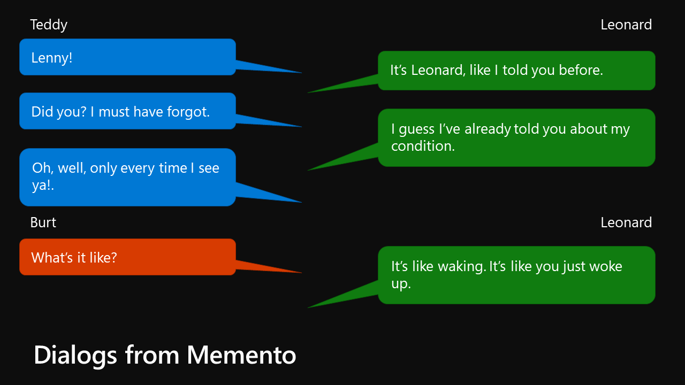

# I, Chatbot

Table of Contents

* [Part 1 - First Bot](01-FirstBot.md)
* [Part 2 - QnA Maker](02-QnAMaker.md)
* [Part 3 - Bot State](03-State.md) <-- this section
* [Part 4 - Dialogs](04-Dialogs.md)
* [Part 5 - LUIS](05-LUIS.md)
* [Part 6 - Adaptive Cards](06-AdaptiveCards.md)
* [Part 7 - Calling back-end services](07-CallingServices.md)

## Bot State

