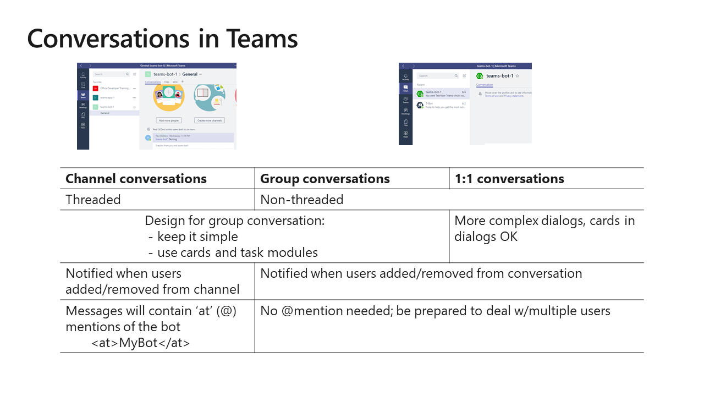
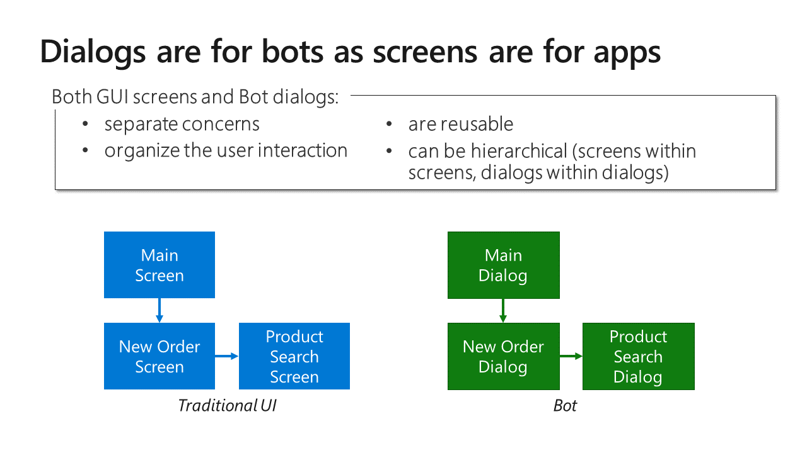
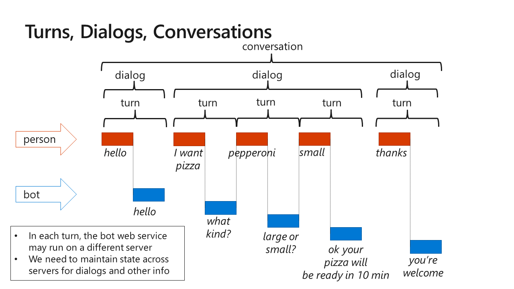
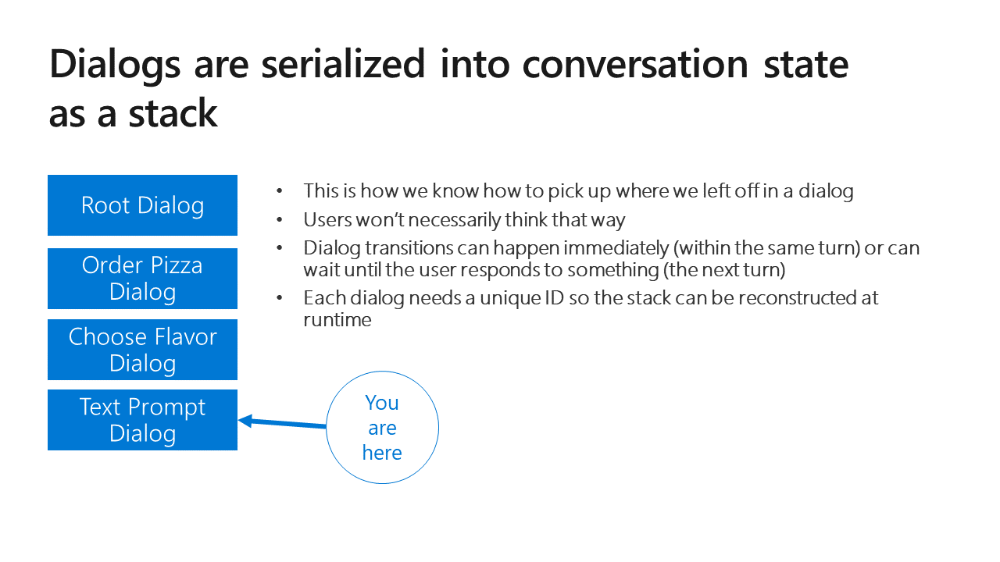
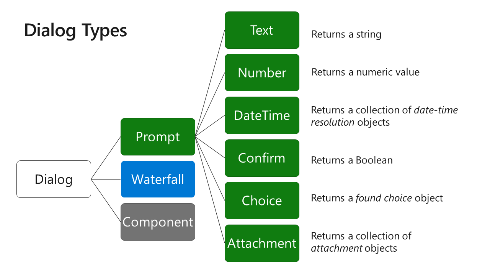
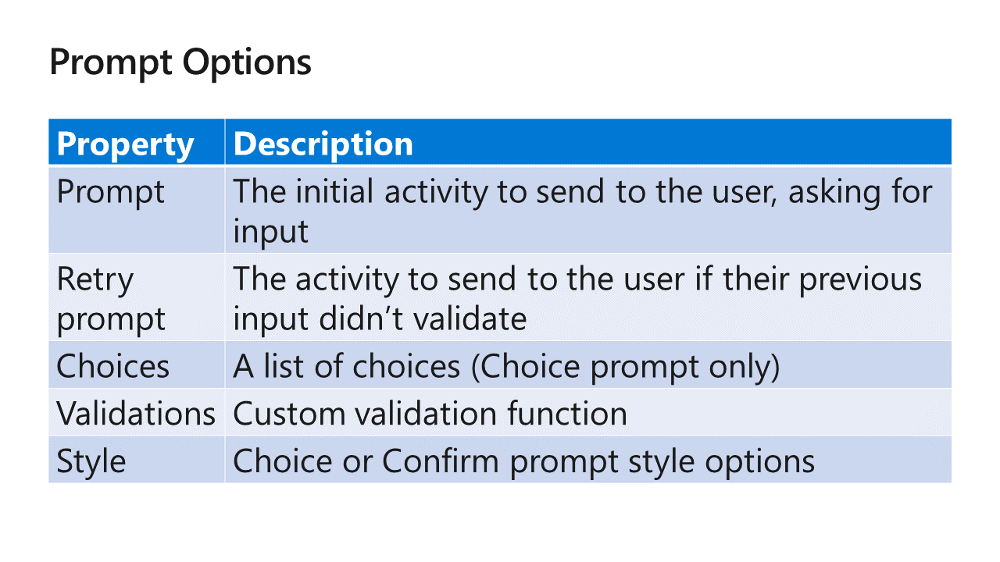
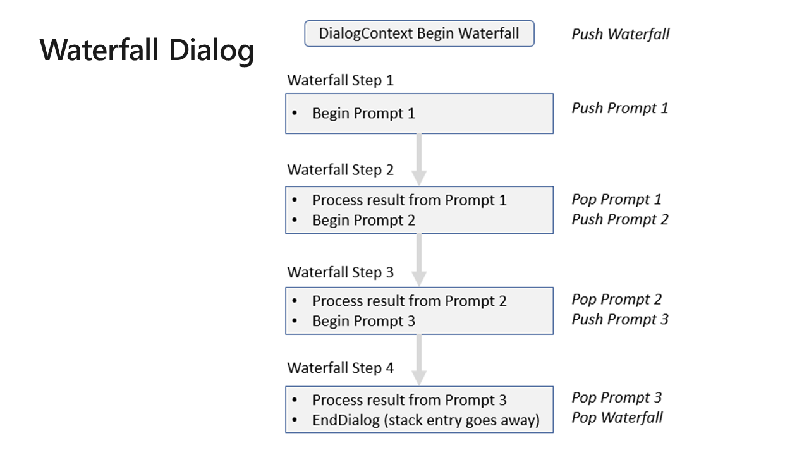
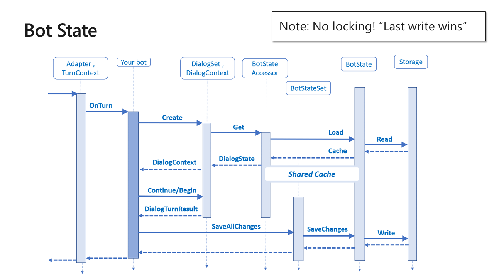
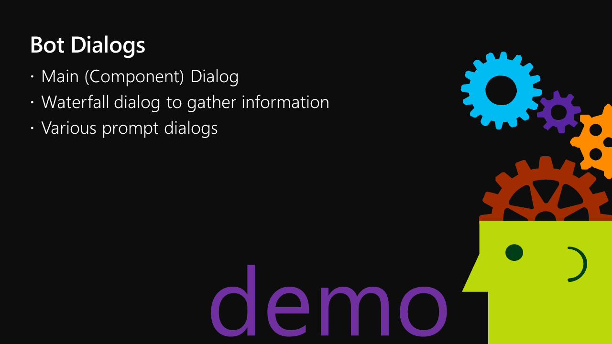

# I, Chatbot

Table of Contents

* [Part 1 - First Bot](01-FirstBot.md)
* [Part 2 - QnA Maker](02-QnAMaker.md)
* [Part 3 - Bot State](03-State.md)
* [Part 4 - Dialogs](04-Dialogs.md) <-- this section
* [Part 5 - LUIS](05-LUIS.md)
* [Part 6 - Adaptive Cards](06-AdaptiveCards.md)
* [Part 7 - Calling back-end services](07-CallingServices.md)

## Dialogs

Different environments call for different dialog styles. Teams channels are threaded, and a back-and-forth conversation can get confusing so cards are better.

See [Design and control conversation flow](https://docs.microsoft.com/en-us/azure/bot-service/bot-service-design-conversation-flow?view=azure-bot-service-4.0) for more details.

Here's [an overview](https://docs.microsoft.com/en-us/azure/bot-service/bot-builder-concept-dialog?view=azure-bot-service-4.0) of dialogs in Bot Framework v4. I found [this, more succinct article](https://www.brightdevelopers.com/overview-of-dialogs-for-bot-framework-v4/) helpful as well.

If you want to add branching and looping to your dialogs, check out [Create advanced conversation flow using branches and loops](https://docs.microsoft.com/en-us/azure/bot-service/bot-builder-dialog-manage-complex-conversation-flow).

Prompt options are detailed here ([.NET](https://docs.microsoft.com/en-us/dotnet/api/microsoft.bot.builder.dialogs.promptoptions), [Node](https://docs.microsoft.com/en-us/javascript/api/botbuilder-dialogs/promptoptions)).

The [Multi-turn prompt sample](https://docs.microsoft.com/en-us/azure/bot-service/bot-builder-dialog-manage-conversation-flow) shows a sequence of several prompt dialogs called by a waterfall dialog.

Notice that the bot saves state at the end of each turn.

Walk through the [Consuling Bot dialogs](../ConsultingBot/ConsultingBot/Dialogs/).

---
__**CHALLENGE**__ (after class)

* The current sample resolves the project and looks up its information in the Add to Project dialog, but not the Bill to Project dialog. Resolve the project in both dialogs.
---

### [The next section is here](05-LUIS.md)

## Repos used in this workshop:

1. [https://github.com/BobGerman/Bots](https://github.com/BobGerman/Bots): Bob's repo, containing samples specific to this workshop, and these notes

1. [https://github.com/microsoft/BotBuilder-Samples](https://github.com/microsoft/BotBuilder-Samples): Great samples for Bot Framework - now including Teams examples!

1. [https://github.com/OfficeDev/msteams-samples-outgoing-webhook-nodejs](https://github.com/OfficeDev/msteams-samples-outgoing-webhook-nodejs): Outgoing webhook - the simplest bot for Teams

1. [https://github.com/OfficeDev/msteams-sample-contoso-hr-talent-app.git](https://github.com/OfficeDev/msteams-sample-contoso-hr-talent-app.git): Great Teams bot/app sample showing an HR recruiting application

