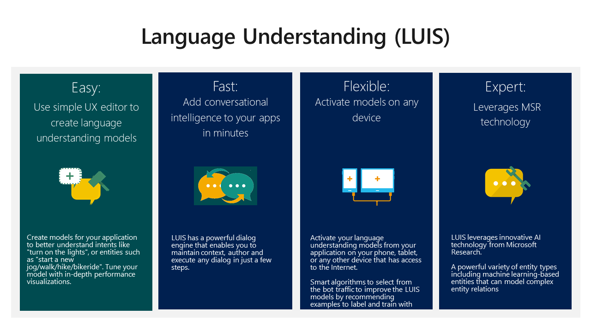
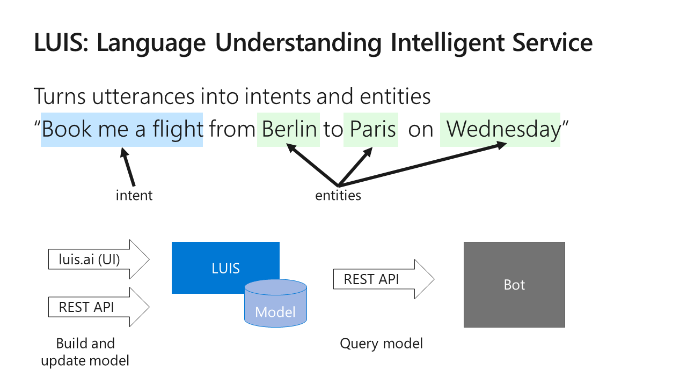
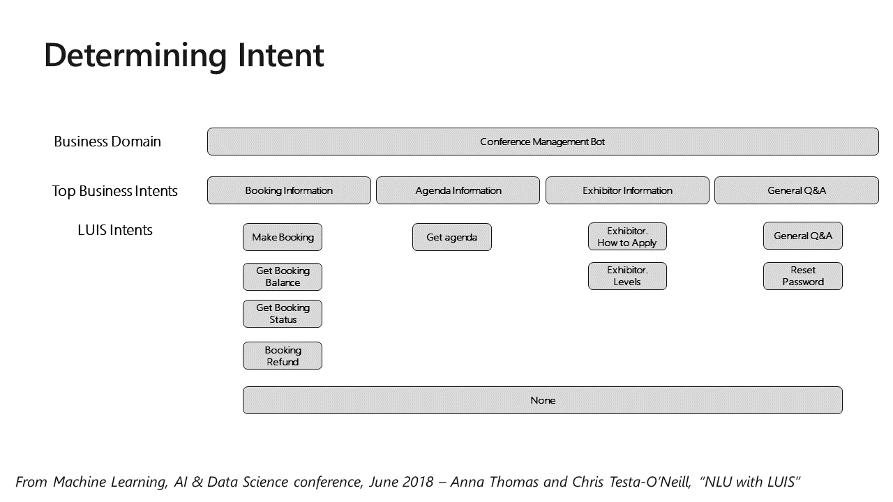
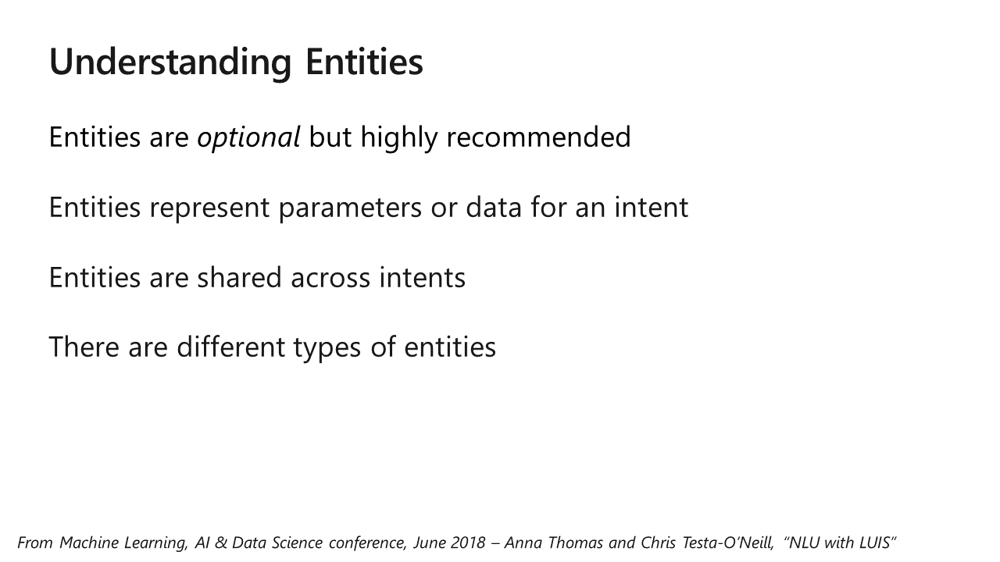
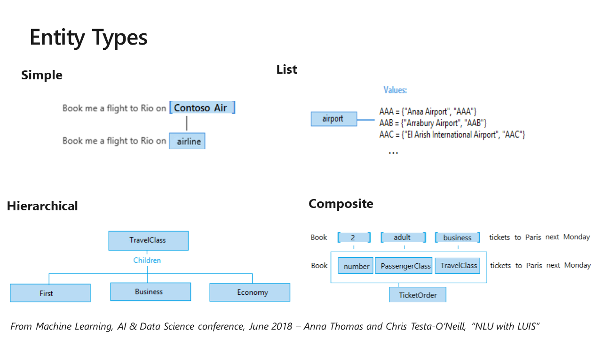
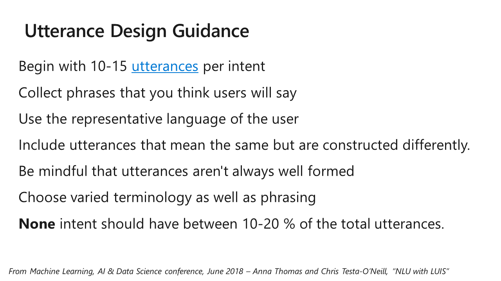
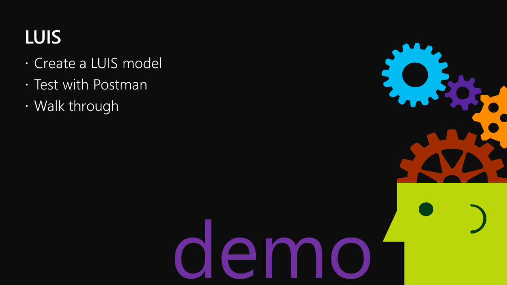
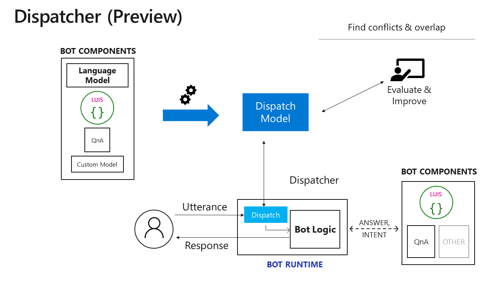

# I, Chatbot

Table of Contents

* [Part 1 - First Bot](01-FirstBot.md)
* [Part 2 - QnA Maker](02-QnAMaker.md)
* [Part 3 - Bot State](03-State.md)
* [Part 4 - Dialogs](04-Dialogs.md)
* [Part 5 - LUIS](05-LUIS.md) <-- this section
* [Part 6 - Adaptive Cards](06-AdaptiveCards.md)
* [Part 7 - Calling back-end services](07-CallingServices.md)

## LUIS

LUIS stands for Language Understanding Intelligent Service. Learn more and sign up at [https://www.luis.ai](https://www.luis.ai).

LUIS attempts to turn utterances (what the user says) into intents (what the user wants to do) and entities (details about the intent).

This and the next couple of  slides are from [the LUIS section](https://azure.github.io/LearnAI-DesigningandArchitectingIntelligentAgents/03-luis/1_session.html) of [Learn AI - Designing and Architecting Intelligent Agents](https://azure.github.io/LearnAI-DesigningandArchitectingIntelligentAgents/).

See [this article](https://docs.microsoft.com/en-us/azure/cognitive-services/luis/luis-concept-intent) for more on LUIS intents.

See [this article](https://docs.microsoft.com/en-us/azure/cognitive-services/luis/luis-concept-entity-types) for details on the LUIS entity types.

Here are some [best practices](https://docs.microsoft.com/en-us/azure/cognitive-services/luis/luis-concept-best-practices) for building a LUIS model.

LUIS won't get everything, and the entities it extracts will be raw text. Plan to prompt the user for anything that's missing, and to resolve and disambiguate what you do get.

The [AddProjectDialog](../ConsultingBot/ConsultingBot/Dialogs/AddToProjectDialog.cs) and [BillToProjectDialog](../ConsultingBot/ConsultingBot/Dialogs/BillProjectDialog.cs) in the Consulting Bot show how to do this.

The LUIS model is in the cognitiveModels folder in many Bot projects. In the ConsultingBot sample, I put the LUIS code and models in a folder called [LUIS](../ConsultingBot/ConsultingBot/LUIS/).

---
__**CHALLENGE**__

Point your browser to [https://www.luis.ai](https://www.luis.ai). If you don't have an account, sign up for a trial; all you need is a Microsoft ID and no credit card is required.

* Build a pizza shop model that supports two intents: order pizza and order drink
* Add entities for the pizza and drink types and sizes. Suggestion: Keep it simple - just a few choices.
* Test your model within the LUIS UI. Find an utterance that doesn't work, and improve your model to fix it.

---

If you want to use multiple LUIS and/or QnA Maker models, check out the [Dispatch tool](https://docs.microsoft.com/en-us/azure/bot-service/bot-builder-tutorial-dispatch?view=azure-bot-service-4.0&tabs=cs).

### [The next section is here](06-AdaptiveCards.md)

## Repos used in this workshop:

1. [https://github.com/BobGerman/Bots](https://github.com/BobGerman/Bots): Bob's repo, containing samples specific to this workshop, and these notes

1. [https://github.com/microsoft/BotBuilder-Samples](https://github.com/microsoft/BotBuilder-Samples): Great samples for Bot Framework - now including Teams examples!

1. [https://github.com/OfficeDev/msteams-samples-outgoing-webhook-nodejs](https://github.com/OfficeDev/msteams-samples-outgoing-webhook-nodejs): Outgoing webhook - the simplest bot for Teams

1. [https://github.com/OfficeDev/msteams-sample-contoso-hr-talent-app.git](https://github.com/OfficeDev/msteams-sample-contoso-hr-talent-app.git): Great Teams bot/app sample showing an HR recruiting application

