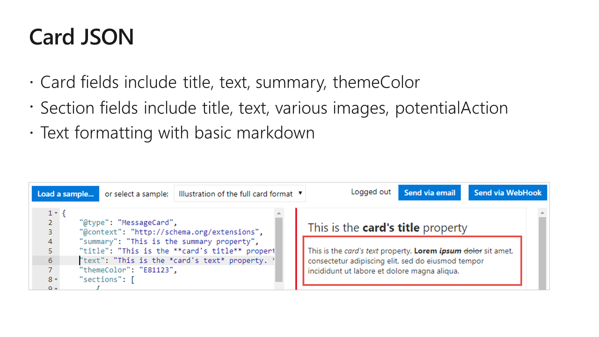

# I, Chatbot

Table of Contents

* [Part 1 - First Bot](01-FirstBot.md)
* [Part 2 - QnA Maker](02-QnAMaker.md)
* [Part 3 - Bot State](03-State.md)
* [Part 4 - Dialogs](04-Dialogs.md)
* [Part 5 - LUIS](05-LUIS.md)
* [Part 6 - Adaptive Cards](06-AdaptiveCards.md) <-- this section
* [Part 7 - Calling back-end services](07-CallingServices.md)

## Adaptive Cards and Messaging Extensions

[Adaptive Cards](https://adaptivecards.io/) fill a middle ground between a web browser and application-specific cards. They are reusable but allow the hosting application flexibility to present them so they look like they're part of the application.

If you've ever approved a Flow action, you've used an adaptive card in Outlook.

You can even [implement your own renderer](https://docs.microsoft.com/en-us/adaptive-cards/rendering-cards/implement-a-renderer).

* [Adaptive Card Playground](http://bit.ly/CardPlayground)
* [Adaptive Card Designer](http://bit.ly/CardDesigner)

---
**CHALLENGE**

Open and run [this Plunker project](https://bit.ly/CardPlunk), which will display an adaptive card on a web page. When you submit the card, it will update (replace w/a new card) showing the data you submitted.

Here are some challenges; choose any you like or try them all!

* Make a card that allows you to configure an ice cream sundae
* Here in Plunker, replace my boring card with your new card
* When the user clicks Submit, show a confirmation card that displays the sundae details
* Make the "Learn more" button work and open the adaptive cards page

---

For more information about adding media to Bot messages, see [this article](https://docs.microsoft.com/en-us/azure/bot-service/bot-builder-howto-add-media-attachments).

For more information about messaging extensions, see [this article](https://docs.microsoft.com/en-us/microsoftteams/platform/concepts/messaging-extensions/messaging-extensions-overview).

NOTE: Messaging extensions where originally called "Compose Extensions", and [still are in the Teams manifest](https://docs.microsoft.com/en-us/microsoftteams/platform/resources/schema/manifest-schema#composeextensions).

### [The next section is here](07-CallingServices.md)

## Repos used in this workshop:

1. [https://github.com/BobGerman/Bots](https://github.com/BobGerman/Bots): Bob's repo, containing samples specific to this workshop, and these notes

1. [https://github.com/microsoft/BotBuilder-Samples](https://github.com/microsoft/BotBuilder-Samples): Great samples for Bot Framework v4

1. [https://github.com/OfficeDev/msteams-samples-outgoing-webhook-nodejs](https://github.com/OfficeDev/msteams-samples-outgoing-webhook-nodejs): Outgoing webhook - the simplest bot for Teams

1. [https://github.com/OfficeDev/BotBuilder-MicrosoftTeams-dotnet](https://github.com/OfficeDev/BotBuilder-MicrosoftTeams-dotnet): Beta of Teams .NET SDK for Bot Framework v4; samples are included

1. [https://github.com/OfficeDev/BotBuilder-MicrosoftTeams-node](https://github.com/OfficeDev/BotBuilder-MicrosoftTeams-node): Beta of Teams Node SDK for Bot Framework v4; samples are included

1. [https://github.com/coolc0ders/Real-Proactive-Message-Bot:](https://github.com/coolc0ders/Real-Proactive-Message-Bot): Shows how to build a "proactive" bot for Teams - i.e. the Bot initiates conversation

1. [https://github.com/OfficeDev/msteams-sample-contoso-hr-talent-app.git](https://github.com/OfficeDev/msteams-sample-contoso-hr-talent-app.git): Great Teams bot/app sample but it's v3

