# I, Chatbot

Table of Contents

* [Part 1 - First Bot](01-FirstBot.md)
* [Part 2 - QnA Maker](02-QnAMaker.md)
* [Part 3 - Bot State](03-State.md)
* [Part 4 - Dialogs](04-Dialogs.md)
* [Part 5 - LUIS](05-LUIS.md)
* [Part 6 - Adaptive Cards](06-AdaptiveCards.md)
* [Part 7 - Calling back-end services](07-CallingServices.md) <-- this section

## Calling back-end services

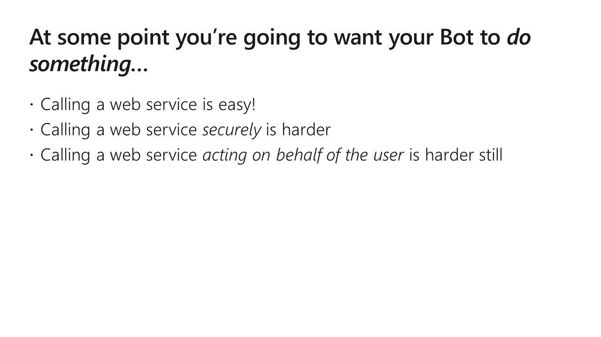

If you want your bot to _do_ something (for better or worse), you're going to need it to access business and collaboration data. That probably means calling _authenticated web services_.

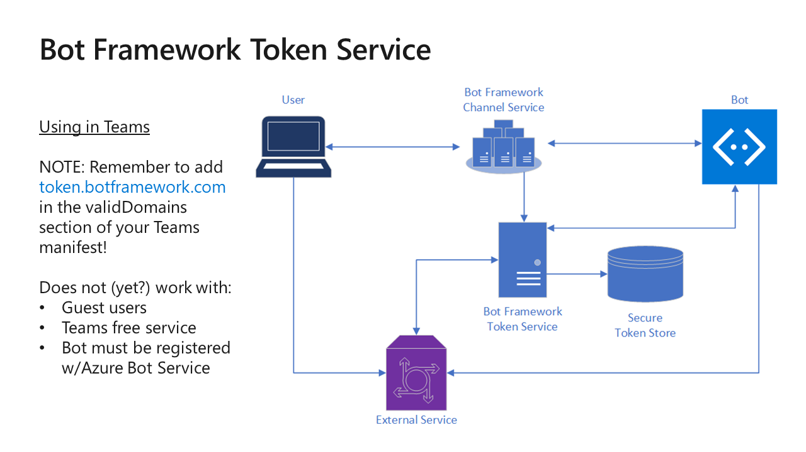

The [Bot Framework Token Service](https://docs.microsoft.com/en-us/azure/bot-service/bot-builder-concept-authentication?view=azure-bot-service-4.0) allows your bot to authenticate a user, and obtain an [access token](https://docs.microsoft.com/en-us/azure/active-directory/develop/access-tokens) so you can make API calls on the user's behalf.

TIP: You can view an access token using [https://jwt.ms/](https://jwt.ms/). JWT stands for "JSON Web Token" and is an [industry standard](https://jwt.io/). JWT is pronounced "jot".

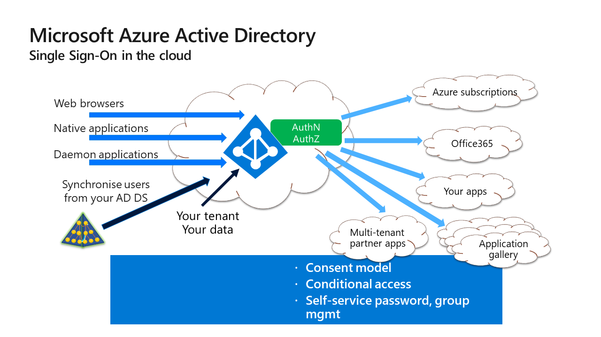

[Azure Active Directory](https://azure.microsoft.com/en-us/services/active-directory/) is used by both Azure and Office 365 to store user, group, application, and device identities and more.

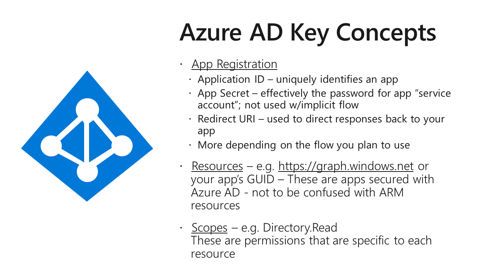

[Here's a quickstart](https://docs.microsoft.com/en-us/azure/active-directory/develop/quickstart-register-app) for registering an application with the v2 service. Note that SharePoint Framework uses the v1 service, so apps registered in this manner won't work with SharePoint Framework. [This article](https://laurakokkarinen.com/how-to-set-up-an-azure-ad-application-registration-for-calling-microsoft-graph/) by [MVP Laura Kokkarinen](https://twitter.com/LauraKokkarinen) explains.

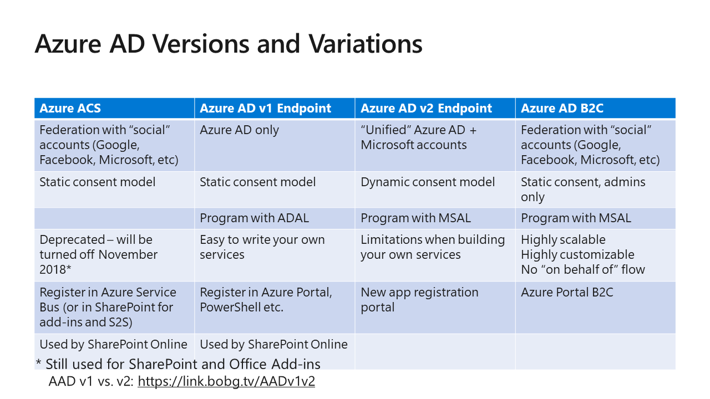

Because this just wasn't confusing enough, Microsoft recently renamed Azure AD v2 to "Microsoft Identity Platform".

[This article](https://docs.microsoft.com/en-us/azure/active-directory/develop/azure-ad-endpoint-comparison) explains the differences between the v1 and v2 endpoints, and will help you determine which to use. Again, note that SharePoint Framework uses v1, so if you want to call your service from SPFx, stick with v1 for now.

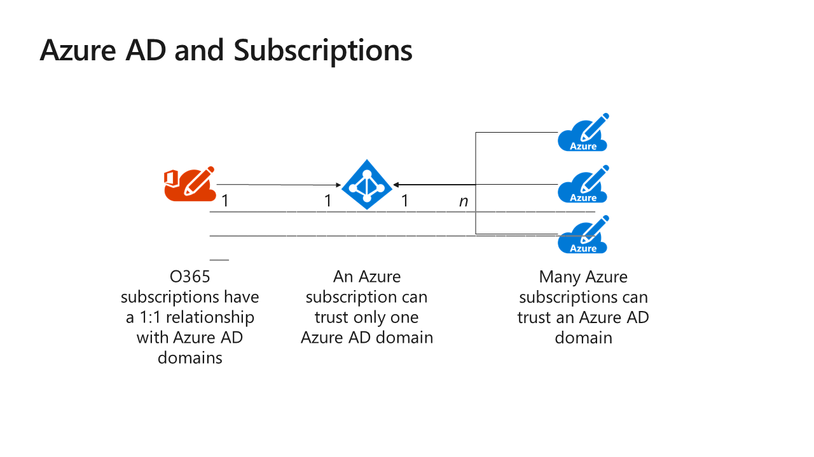

[This article](https://samcogan.com/changing-an-azure-subscriptions-tenant/) explains how to switch your Azure subscription to the same directory as your O365 subscription. NOTE: Things will break. In general, do this in an empty or new Azure subscription.

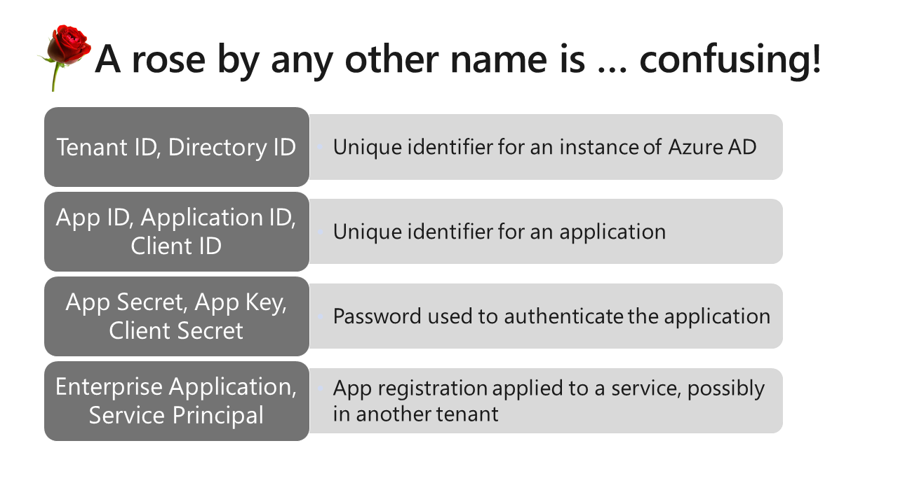

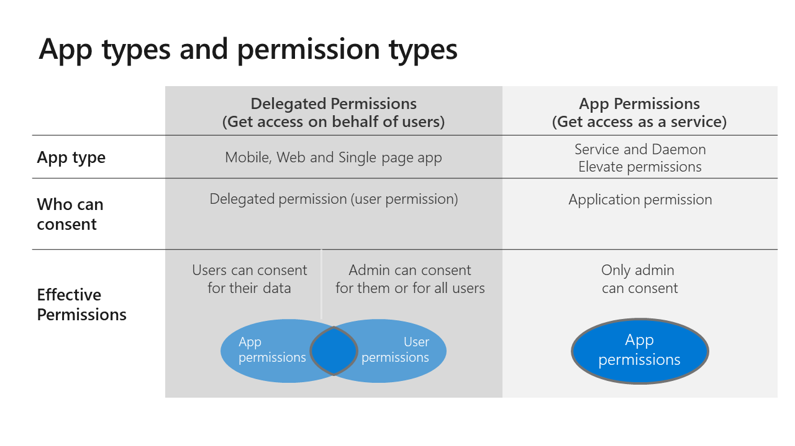

For more details, see [this article for Azure AD v1](https://docs.microsoft.com/en-us/azure/active-directory/develop/v1-permissions-and-consent) or [this article for Azure AD v2](https://docs.microsoft.com/en-us/azure/active-directory/develop/v2-permissions-and-consent).

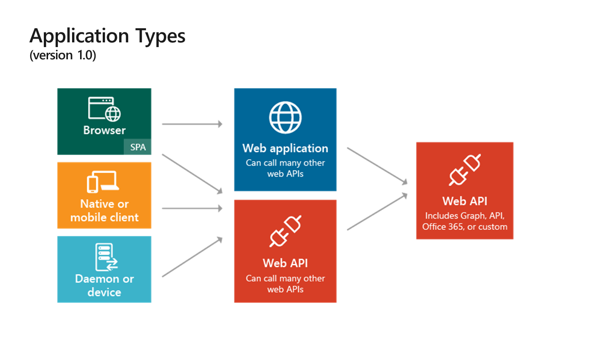
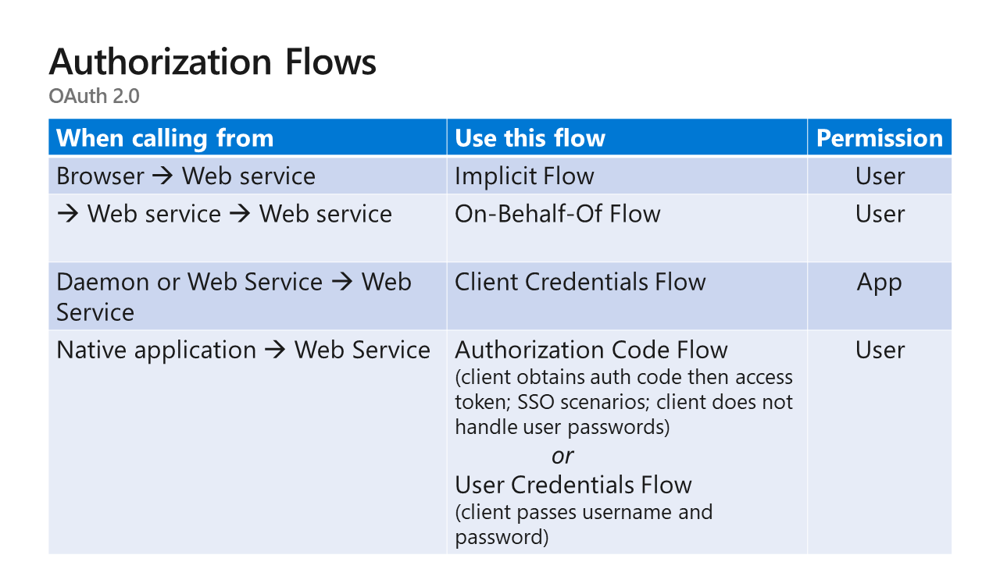

[OAuth 2.0](https://oauth.net/2/) is an industry standard used by Azure AD and many other cloud based services. Although it's a standard, it's not sufficiently complelte to allow interoperability among implementations so, for example, you can't log into an Azure AD app with a Facebook or Twitter login.

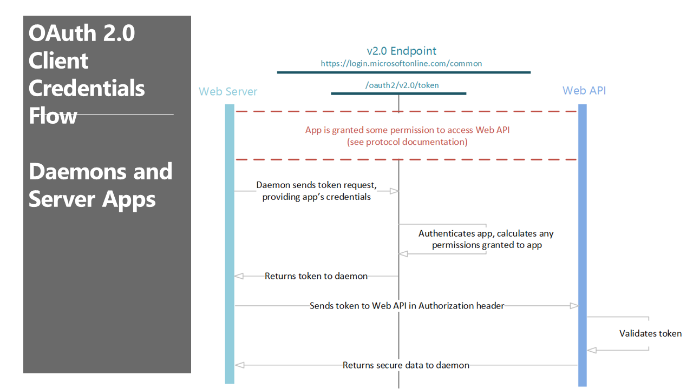

OAuth 2.0 supports "flows" (interactions) - not to be confused with Microsoft Flow.

The Bot Channel Service authenticates bots using the [Client Credentials Grant Flow](https://docs.microsoft.com/en-us/azure/active-directory/develop/v2-oauth2-client-creds-grant-flow). This is the same flow you'd use in a background process where there is no UI. Client Credentials Flow only works with Application permissions.

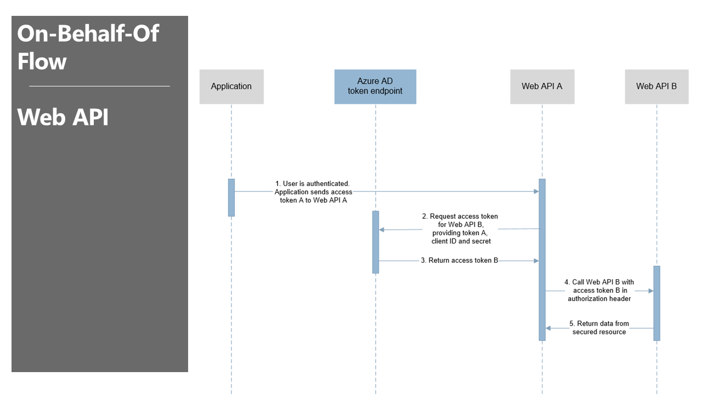

The [On Behalf Of (OBO)](https://docs.microsoft.com/en-us/azure/active-directory/develop/v2-oauth2-on-behalf-of-flow) flow is used by the Bot Token Service to authenticate a user and act on his or her behalf. The OBO Flow only works with User Delegated permissions.

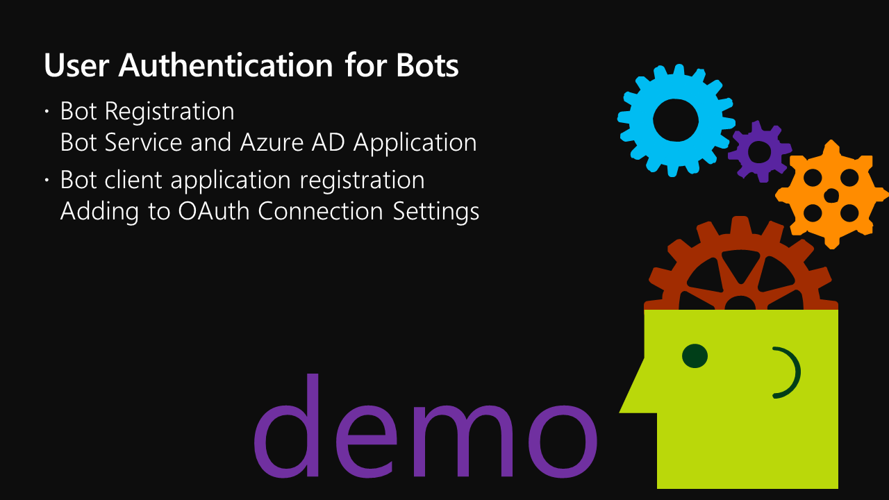
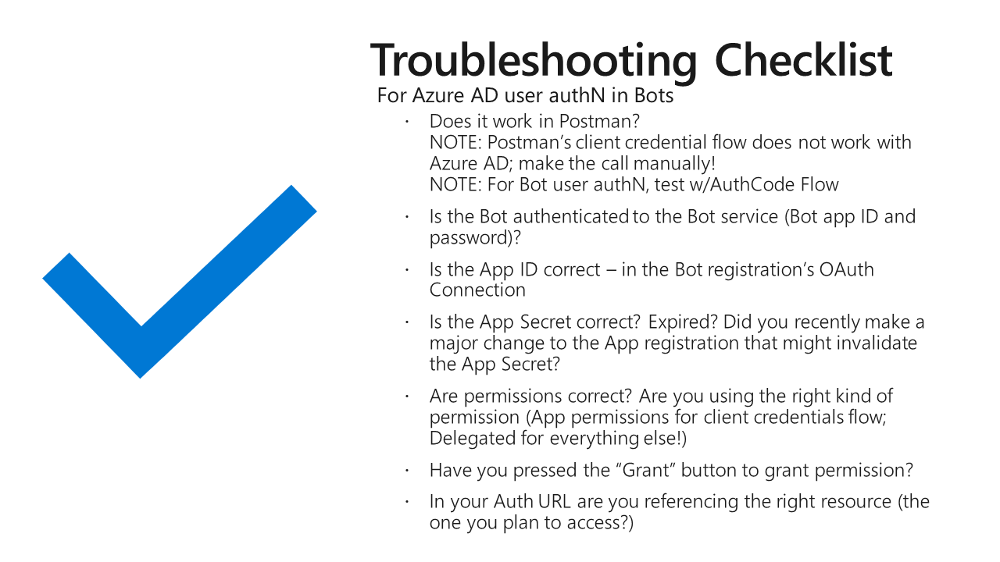

There's nothing more frustrating than getting a 401 - Access Denied, with no idea why. Here are my handy troubleshooting steps.

---
__**CHALLENGE**__ (after class)

* Download or clone the [Bot Builder Samples](https://github.com/microsoft/BotBuilder-Samples) and find the demo 46.teams-auth in the language of your choice.
* Follow the instructions in the readme to register, build, and run the sample
* Modify the sample to call the Graph API instead of just showing the token

---

### ** THE END **

## Repos used in this workshop:

1. [https://github.com/BobGerman/Bots](https://github.com/BobGerman/Bots): Bob's repo, containing samples specific to this workshop, and these notes

1. [https://github.com/microsoft/BotBuilder-Samples](https://github.com/microsoft/BotBuilder-Samples): Great samples for Bot Framework - now including Teams examples!

1. [https://github.com/OfficeDev/msteams-samples-outgoing-webhook-nodejs](https://github.com/OfficeDev/msteams-samples-outgoing-webhook-nodejs): Outgoing webhook - the simplest bot for Teams

1. [https://github.com/OfficeDev/msteams-sample-contoso-hr-talent-app.git](https://github.com/OfficeDev/msteams-sample-contoso-hr-talent-app.git): Great Teams bot/app sample showing an HR recruiting application

